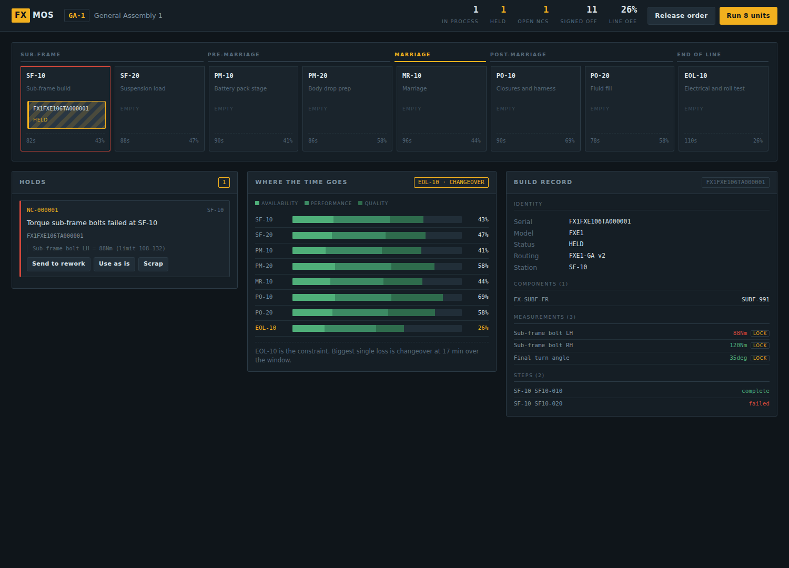

# FX MOS

A Manufacturing Operating System core: production control, traceability,
process interlocking and OEE for discrete assembly lines.


Built by [FitEx Industrial](https://fitexindustrial.com).
Commercial licence — see [LICENSE](LICENSE).



*A unit held at SF-10. The hazard stripes mean the interlock has it; the panel
below names the failing measurement and its window. Nothing behind it moves
until a supervisor dispositions the hold.*

---

## What it does

A MOS sits between the order system and the machines. It decides what gets
built, in what order, whether it is allowed to move, and what gets written down.

| | |
|---|---|
| **Production control** | Dispatches units station by station against a released routing |
| **Traceability** | Records the birth certificate of every unit, and answers "which units contain this lot" |
| **Quality assurance** | Enforces the routing so defects are prevented rather than found later |
| **Process interlocking** | Holds a unit in place when a critical measurement or part scan is missing |
| **Data logging** | Captures torque, angle, resistance, volume, cycle time with the spec window in force at the time |
| **Paperless operations** | Serves the work instruction for the current step to the operator |
| **Equipment monitoring** | Computes OEE per station and names the line's constraint |

The reference line models a full vehicle progression:

```
SUB-FRAME  →  PRE-MARRIAGE  →  MARRIAGE  →  POST-MARRIAGE  →  END OF LINE
 SF-10        PM-10           MR-10         PO-10             EOL-10
 SF-20        PM-20                         PO-20
```

## Two layouts

**SEQUENTIAL** — a line. Units travel station to station in order and a station
cannot be skipped. The gate asks *may this unit move downstream*.

**PARALLEL** — a shop. Each bay is an independent resource with its own
capabilities; a unit is assigned to one bay, all its work happens there, and it
leaves from there. The gate asks *may this unit go back to the customer*.

The reference PARALLEL configuration is a ten-bay auto service shop — see
[docs/SHOP.md](docs/SHOP.md).

```bash
python -m fx_mos.simulator_shop --vehicles 80 --reset
```

---

## Quickstart

```bash
pip install -r requirements.txt

# Push 30 units through the virtual line
python -m fx_mos.simulator --units 30 --defect-rate 0.07 --reset

# Start the API and floor display
uvicorn fx_mos.api.main:app --reload
# open http://localhost:8000

pytest -q          # 28 tests
```

The floor display polls one aggregate endpoint and lets a supervisor
disposition a hold without leaving the board.

---

## Architecture

```
                  ┌──────────────────────────────┐
   Order system   │        fx_mos/api            │   Floor display
   ──────────────►│  thin HTTP over the engine   │◄──────────────
                  └──────────────┬───────────────┘
                                 │
          ┌──────────────────────┼──────────────────────┐
          │                      │                      │
   ┌──────▼──────┐        ┌──────▼──────┐        ┌──────▼──────┐
   │  routing    │        │   gating    │        │  execution  │
   │ author,     │        │ may this    │        │ start, run  │
   │ validate,   │        │ unit move?  │        │ step,       │
   │ release     │        │             │        │ advance     │
   └─────────────┘        └─────────────┘        └──────┬──────┘
                                                        │
          ┌──────────────┬──────────────┬───────────────┤
   ┌──────▼──────┐┌──────▼──────┐┌──────▼──────┐ ┌──────▼──────┐
   │  genealogy  ││     nc      ││     oee     │ │ erp/outbox  │
   └─────────────┘└─────────────┘└─────────────┘ └─────────────┘
```

Rules live in `fx_mos/engine`, never in the HTTP layer. A PLC gateway or an
MQTT bridge can drive the same logic without going through REST.

Storage is SQLAlchemy over SQLite by default. Set `FX_MOS_DATABASE_URL` to a
Postgres URL for production — no SQLite-specific types are used.

---

## Three design decisions worth defending

**Flows are versioned and immutable once released.** You cannot edit a released
routing. You clone it to a draft, change it, validate it, and release — which
archives the previous version. Units already on the line keep the version they
started under. This is what makes a build record defensible a year later when a
customer asks what spec was in force on the day their unit was built.

**The gate returns reasons, not a boolean.** Every blocker carries a machine
code (`OUT_OF_SPEC`, `PART_MISSING`, `NC_OPEN`, `STATION_FULL`, ...) and a line
of plain English. The andon board and the ERP can both act on it without
parsing prose, and the operator standing at the conveyor knows what to fix.

**The ERP is never called inside a floor transaction.** Events go into an
outbox table in the same transaction as the process data, and a worker drains
it. If the order system is unreachable, the line keeps running and the events
queue. Inbound orders are idempotent on the order id, because retries are
normal and duplicate VINs are not.

---

## Deploying a new process step

The workflow this system is built around:

```bash
# 1. Clone the released routing into a draft
curl -X POST localhost:8000/api/flows/1/draft

# 2. Add the step, with its measurement contract
curl -X POST localhost:8000/api/flows/2/steps -H 'Content-Type: application/json' -d '{
  "station_code": "EOL-10",
  "code": "EOL10-030",
  "name": "Camera calibration",
  "work_instruction": "Park on the target board. Both cameras must converge.",
  "checks": [{"code":"CAM_YAW","name":"Camera yaw error","uom":"deg",
              "lsl":-0.4,"usl":0.4,"interlock":true}]
}'

# 3. Release it. Live for the next unit started.
curl -X POST localhost:8000/api/flows/2/release -H 'Content-Type: application/json' \
     -d '{"released_by":"process.engineering"}'
```

Validation runs before release and refuses, among other things, a step that
routes a unit backwards through the line, an inverted spec window, a duplicate
check code, or an interlock that records nothing an operator could satisfy.

---

## API

| Method | Path | Purpose |
|---|---|---|
| `GET` | `/api/dashboard` | Everything the floor display needs, one round trip |
| `GET` | `/api/lines` | Line and station layout |
| `GET` | `/api/flows`, `/api/flows/{id}` | Routings, with a validation report |
| `POST` | `/api/flows/{id}/draft` | Clone a released routing to an editable draft |
| `POST` | `/api/flows/{id}/steps` | Add a step to a draft |
| `POST` | `/api/flows/{id}/release` | Validate and make live |
| `POST` | `/api/orders` | Inject an order; allocates VINs, queues units |
| `POST` | `/api/units/{serial}/start` | Put a unit on the first station |
| `POST` | `/api/units/{serial}/steps` | Record a completed step |
| `GET` | `/api/units/{serial}/gate` | May this unit advance, and if not, why |
| `POST` | `/api/units/{serial}/advance` | Move it, if the gate allows |
| `GET` | `/api/units/{serial}/birth-certificate` | Full auditable build record |
| `GET` | `/api/ncs` | Open holds |
| `POST` | `/api/ncs/{code}/disposition` | Rework, use as is, deviation or scrap |
| `GET` | `/api/trace/where-used` | Which units contain a component serial or lot |
| `GET` | `/api/trace/containment` | Recall scope: in plant vs already signed off |
| `GET` | `/api/oee` | Per-station OEE with loss attribution and the constraint |
| `GET` | `/api/erp/outbox`, `POST /api/erp/drain` | Integration queue |
| `POST` | `/api/simulate` | Run a batch through the virtual line |

Interactive docs at `/docs` when the server is running.

---

## OEE

`OEE = Availability × Performance × Quality`

- **Availability** — run time over planned production time. Planned stops
  (breaks, scheduled maintenance) are excluded from the denominator rather than
  held against the station.
- **Performance** — ideal cycle × count, over run time.
- **Quality** — good over total, counted **first pass**. A unit reworked to good
  still counts as a reject at the station that made it.

The line's OEE is its **bottleneck**, not the average of its stations. A line
runs at the pace of its worst station; averaging hides the constraint, which is
the one number a plant manager actually needs.

Every result carries a loss breakdown (`DOWN`, `STARVED`, `BLOCKED`,
`CHANGEOVER`, `SPEED`, `QUALITY`) and names the largest single loss. A station
at 62% because it is starved needs a different fix from one at 62% because it
is jamming.

---

## Scope and honest limits

This is a MOS **core**, not a finished plant deployment. What is deliberately
not here yet:

- No OPC-UA / MQTT / Modbus device layer. Steps are recorded over HTTP; a real
  installation needs a gateway that speaks to the PLCs and torque tools.
- No authentication, roles or electronic signature. A regulated site needs
  21 CFR Part 11 style signed records before this can be used for release.
- No scheduling optimiser. Units are dispatched in order, not sequenced.
- Single-plant. Multi-site rollup is not modelled.
- The simulator's spec limits are illustrative, not an engineering release.

It is **not a safety system.** Physical interlocks, e-stops, guarding and
safety PLCs must remain independent of it. See Section 7 of the LICENSE.

---

## Prior art

The design follows ISA-95 equipment and routing hierarchies and standard MES
concepts — genealogy, gated progression, first-pass yield, OEE loss buckets.
It is a clean-room implementation. It is not a reproduction of any vendor's
product, and the public reporting about internal systems at large automakers is
journalism rather than documentation.
